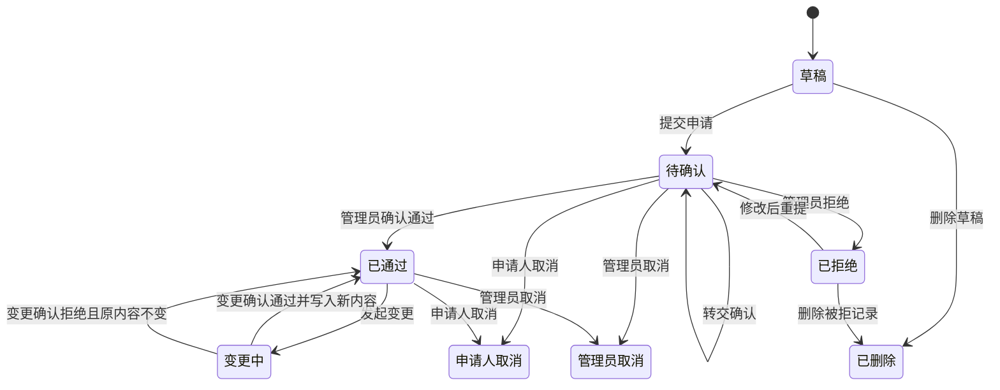
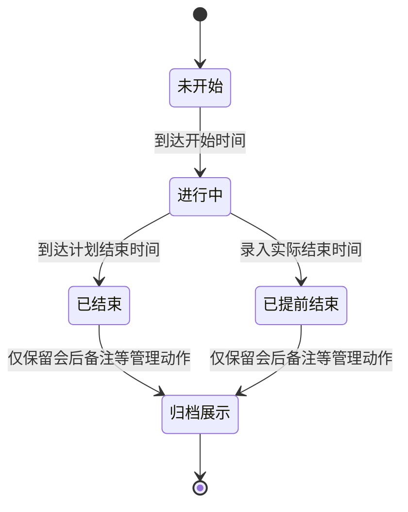
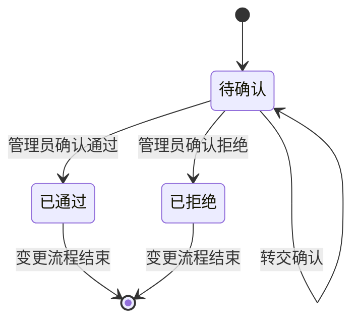
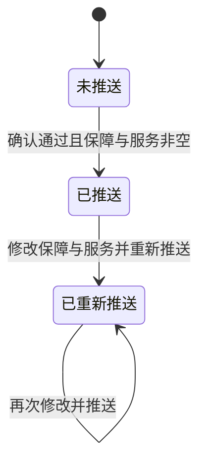
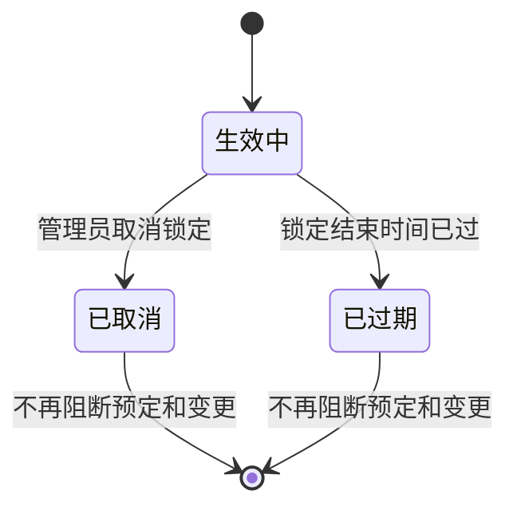
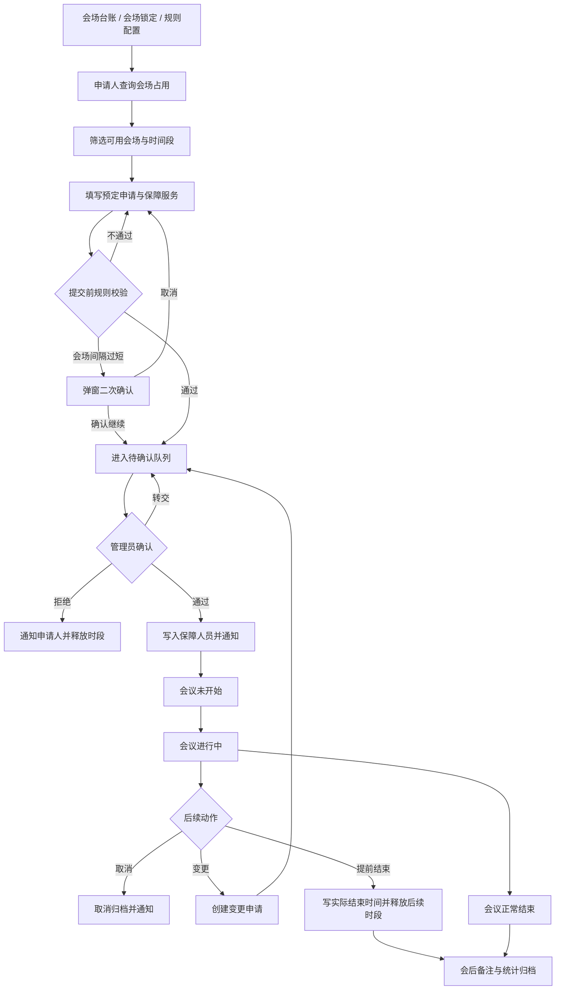

# 公用会场预定管理系统产品设计方案

> **项目名称**：公用会场预定管理系统  
> **文档版本**：第二版  
> **更新日期**：2026-05-08  
> **面向对象**：客户管理层、业务负责人、研发团队、会场管理员、会议保障人员  

---

## 一、项目概述

本系统面向单位内部公用会场资源，建立统一的会场台账、占用查询、会议预定、会议确认、保障协同、会场锁定、消息通知和统计分析能力。系统以"会场资源"为底座，以"查询会场、提交预定、管理员确认、保障人员执行、会后归档"为主流程，解决线下沟通效率低、会场占用不透明、会议保障信息不同步、变更和取消缺少留痕的问题。

- **会场资源管理**：维护会场容量、位置、涉密属性、桌型是否可调、启用状态和锁定时段。
- **会议预定管理**：支持电脑端和移动端提交预定、草稿、变更、取消、提前结束和会后备注。
- **会议确认管理**：管理员处理待确认预定和变更申请，支持确认通过、拒绝、转交、管理员取消和保障人员指派。
- **保障协同管理**：会议保障人员接收任务、查看服务需求、申请转班；申请人和管理员可修改保障与服务并重新推送。
- **过程追踪与统计**：通过消息、操作记录、状态标签和统计看板沉淀全流程数据。

---

## 二、核心角色与权限

### 2.1 角色定义

| 角色名称 | 职责说明 | 核心入口 |
| --- | --- | --- |
| 申请人 | 默认基础角色，可查询会场、发起预定、查看本人预定、取消、变更、提前结束本人会议，并接收消息。 | 会场查询、会场可用性查询、发起预定申请、我的预定、消息中心、移动端工作台 |
| 会场管理员 | 处理待确认预定和变更，维护会场和规则，创建/取消会场锁定，指派保障人员，查看全量数据和统计。 | 待确认队列、确认处理、全量预定查询、会场锁定记录、数据统计、基础配置、系统设置 |
| 会议保障人员 | 接收会议保障任务，查看会议详情和保障与服务需求，申请任务转班。 | 我的接待（保障任务）、消息中心、移动端我的保障 |

> 角色可叠加：管理员和保障人员同时继承申请人能力；系统不再单独设计“系统管理员”“服务人员”等额外业务角色。

### 2.2 权限矩阵

| 功能域 | 申请人 | 会场管理员 | 会议保障人员 |
| --- | --- | --- | --- |
| 会场占用查询 | 查看 | 查看 | 查看 |
| 会场可用性查询 | 查看/选房 | 查看/选房 | 查看/选房 |
| 预定申请 | 新建/草稿/提交 | 新建/草稿/提交 | 新建/草稿/提交 |
| 我的预定 | 仅本人 | 仅本人 | 仅本人 |
| 预定详情 | 本人记录 | 全量记录 | 仅任务关联 |
| 取消预定 | 本人待确认或已通过记录 | 任意待确认或已通过记录，需填写原因 | 不可操作 |
| 变更申请 | 本人已通过记录 | 不可代申请 | 不可操作 |
| 提前结束 | 本人进行中会议 | 任意进行中会议 | 不可操作 |
| 待确认队列 | 不可见 | 查看/处理 | 不可见 |
| 确认通过/拒绝/转交 | 不可操作 | 可操作 | 不可操作 |
| 保障人员指派/调整 | 不可操作 | 可操作 | 不可操作 |
| 保障与服务修改 | 本人未结束会议 | 未结束会议 | 只读 |
| 保障任务转班 | 不可操作 | 不可操作 | 可操作 |
| 会后备注 | 只读查看 | 填写/修改 | 只读查看 |
| 会场锁定记录 | 不可见 | 创建/取消/查看 | 不可见 |
| 全量预定查询 | 不可见 | 查看/筛选 | 不可见 |
| 数据统计 | 不可见 | 查看 | 不可见 |
| 基础配置 | 不可见 | 维护 | 不可见 |
| 消息中心 | 仅本人消息 | 仅本人消息 | 仅本人消息 |

---

## 三、业务对象

| 对象编号 | 业务对象 | 说明 | 关键信息 |
| --- | --- | --- | --- |
| O01 | 会场 | 可预定、可查询、可锁定的空间资源 | 会场名称、容量、位置、涉密属性、桌型是否可调、启用状态 |
| O02 | 预定申请 | 一次会议预定的核心主对象，贯穿申请、确认、执行和归档 | 申请人、会场、会议主题、开始时间、结束时间、确认状态、执行状态、保障人员、会后备注 |
| O03 | 变更申请 | 对已通过预定发起的字段级变更请求 | 原预定、变更内容快照、变更原因、变更状态、当前确认人 |
| O04 | 保障与服务 | 与预定一对一，记录服务项、数量、备注和推送状态 | 服务项列表、补充说明、推送状态、推送时间 |
| O05 | 操作记录 | 记录确认、拒绝、转交、取消、指派、提前结束、备注更新等关键动作 | 关联业务、操作人、动作、意见、操作时间 |
| O06 | 系统消息 | 面向个人的站内通知 | 接收人、消息类型、标题、正文、关联预定、是否已读 |
| O07 | 会场锁定 | 管理员手动屏蔽会场某段时间，阻断预定和变更 | 会场、开始时间、结束时间、锁定原因、锁定状态、取消原因 |
| O08 | 系统参数 | 维护业务校验和提醒阈值 | 最短提前申请分钟数、会场间隔提醒分钟数、会前提醒分钟数 |
| O09 | 字典项 | 维护服务项、状态标签、会议范围、密级等枚举 | 分类、标签、排序、启用状态 |
| O10 | 角色配置 | 维护管理员和会议保障人员用户绑定关系 | 角色类型、用户、姓名快照、启用状态 |

### 3.1 对象关系

```text
会场
  ├─ 关联多条预定申请
  └─ 关联多条会场锁定

预定申请
  ├─ 关联一条保障与服务
  ├─ 关联多条变更申请
  ├─ 关联多条操作记录
  ├─ 关联多条系统消息
  ├─ 关联一名申请人
  └─ 关联多名会议保障人员

变更申请
  └─ 关联多条操作记录

角色配置
  └─ 关联管理员或会议保障人员用户
```

---

## 四、核心业务模块

### 模块一：会场查询与可用性筛选

- 会场占用查询提供甘特图和列表视图，支持查看有效预定、执行状态和会场锁定时段。
- 会场可用性查询支持按日期、意向时段、参会人数、涉密要求筛选可用会场。
- 选择会场后可进入预定表单，并带入会场和日期。
- 会场锁定以独立占用块展示，命中锁定时段不可提交预定或变更。

### 模块二：预定申请

- 申请人填写会议基本信息、会议属性、会场配置需求、保障与服务。
- 支持保存草稿、草稿继续编辑、被拒绝后修改重提。
- 支持电脑端和移动端时间段快速选择，选择会场和日期后展示可用场次并一键回填开始/结束时间。
- 提交前执行容量、时间合法性、最长 4 小时、提前申请、同范围同日、同主题重复、会场占用、会场锁定、桌型要求等校验。
- 会场间隔过短属于非阻断强提醒，弹窗标题为"会场预定间隔过短"，展示提示图标，用户二次确认后可继续提交。

### 模块三：会议确认处理

- 会场管理员在待确认队列中统一处理预定申请和变更申请。
- 确认处理支持通过、拒绝、转交和管理员取消。
- 确认通过时可多选会议保障人员，也可先留空后续补充。
- 拒绝时需填写原因；管理员取消他人会议时需填写取消原因。
- 变更确认页展示字段级差异，确认通过后将变更字段写回预定主表。

### 模块四：我的预定与预定详情

- 申请人查看本人预定列表，支持确认状态、执行状态、会场、主题等筛选。
- 详情页展示会议基本信息、会议详情、保障人员、保障与服务、操作记录时间轴和消息关联入口。
- 未开始或进行中的有效会议可取消、变更、修改保障与服务；进行中会议可提前结束。
- 已结束和已提前结束后，业务修改类操作关闭，仅管理员可填写或更新会后备注。

### 模块五：预定变更

- 仅已通过预定可发起变更。
- 变更申请可修改会议时间、会场、人数、会议属性、保障与服务等内容，并必须填写变更原因。
- 发起变更时，开始时间和结束时间的页面取值方式与新预定申请保持一致。
- 变更提交前复用新预定申请的容量、最长 4 小时、提前申请、冲突、锁定、同范围同日和会场间隔提醒校验。
- 变更处理期间原预定进入“变更中”，原时段持续占用；确认通过后写回新内容，确认拒绝后恢复“已通过”状态。

### 模块六：保障与服务协同

- 预定申请时同步填写保障与服务项目、数量、备注和补充说明。
- 确认通过或保障人员调整后，系统向被指派人员发送任务消息。
- 申请人或管理员可在会议未结束前修改保障与服务，并选择是否重新推送给当前保障人员。
- 保障与服务为空时阻止无意义推送。
- 服务项标签保存快照，后续字典变动不影响历史记录展示。

### 模块七：会议保障任务

- 会议保障人员在"我的接待（保障任务）"查看被分配的保障任务。
- 任务按待处理和已完成分组，已取消、已结束、已提前结束进入完成态。
- 保障人员可查看会议详情、联系人、议程、保障与服务需求。
- 保障人员可发起转班，转班成功后新旧保障人员均收到消息。
- 当前会议保障支持多人指派，并兼容历史单人保障数据。

### 模块八：会场锁定管理

- 会场管理员可创建会场锁定，填写会场、开始时间、结束时间、锁定原因。
- 锁定状态包含生效中、已取消、已过期。
- 生效锁定会阻断同会场重叠时段的新预定和变更提交。
- 管理员可取消未过期锁定并填写取消原因。
- 会场查询、可用性查询、预定表单时间段提示均应识别锁定占用。

### 模块九：消息通知、统计与基础配置

- 消息中心覆盖提交、确认、拒绝、取消、变更、保障指派、转班、服务重推送、提前结束、会前提醒等场景。
- 电脑端头部消息图标悬停时最多展示 5 条未读消息；无未读时展示“无未读消息”和空状态图片。
- 数据统计展示会场使用、确认状态、执行状态、保障工作量、取消率和提前结束等指标。
- 基础配置维护规则参数、字典、服务选项、会场信息和角色绑定。

---

## 五、业务状态机

### 5.1 预定确认状态机



| 状态 | 时段占用 | 说明 |
| --- | --- | --- |
| 草稿 | 不占用 | 已填写未提交 |
| 待确认 | 占用 | 已提交，等待管理员确认 |
| 已通过 | 占用 | 管理员确认通过 |
| 变更中 | 占用 | 已通过会议正在走变更确认 |
| 已拒绝 | 释放 | 管理员拒绝 |
| 申请人取消 | 释放 | 申请人主动取消 |
| 管理员取消 | 释放 | 管理员执行取消 |

### 5.2 会议执行状态机



| 执行状态 | 判定逻辑 | 允许主操作 |
| --- | --- | --- |
| 未开始 | 当前时间早于开始时间 | 取消、变更、修改保障与服务、调整保障人员 |
| 进行中 | 当前时间位于开始与结束之间 | 取消、变更、提前结束、修改保障与服务、调整保障人员 |
| 已结束 | 当前时间晚于结束时间 | 管理员填写会后备注 |
| 已提前结束 | 实际结束时间早于原计划结束时间 | 管理员填写会后备注 |

> 提前结束不改变会议的确认结果，仍保持“已通过”；通过实际结束时间和执行状态体现。

### 5.3 变更申请状态机



| 状态 | 说明 |
| --- | --- |
| 待确认 | 申请人已提交变更，等待管理员处理 |
| 已通过 | 变更内容写回原预定 |
| 已拒绝 | 原预定内容不变，预定恢复已通过 |

### 5.4 保障与服务推送状态机



| 状态 | 说明 |
| --- | --- |
| 未推送 | 初始为空或尚未通知保障人员 |
| 已推送 | 已通知当前保障人员 |
| 已重新推送 | 服务需求修改后再次通知 |

### 5.5 会场锁定状态机



| 状态 | 对预定影响 |
| --- | --- |
| 生效中 | 阻断同会场重叠时段的预定和变更 |
| 已取消 | 不再阻断 |
| 已过期 | 不再阻断 |

---

## 六、会议预定全生命周期流程



---

## 七、关键业务流程说明

### 7.1 查询会场到提交预定

```text
申请人进入会场查询或会场可用性查询
  -> 选择日期、意向时段、人数、涉密要求
  -> 系统展示可用会场、已有预定和锁定时段
  -> 进入预定表单并带入会场与日期
  -> 选择快速时间段或手动填写开始/结束时间
  -> 填写会议基础信息、会议属性、会场配置需求、保障与服务
  -> 提交前完成容量、时间、冲突、锁定、提前申请、同范围同日、重复主题等校验
  -> 通过校验后进入待确认队列
```

### 7.2 待确认处理

```text
管理员进入待确认队列
  -> 查看预定或变更详情
  -> 必要时填写确认意见、领导意见、选择会议保障人员
  -> 确认通过后预定进入已通过，并通知申请人与保障人员
  -> 拒绝时填写原因，预定释放时段并通知申请人
  -> 转交时更新当前确认人，保留待确认状态
```

### 7.3 变更申请

```text
申请人在已通过预定详情发起变更
  -> 变更页读取原预定并按本地时间展示开始/结束时间
  -> 修改会议时间、会场、人数、会议属性或保障与服务
  -> 提交前复用新预定申请的全部核心校验
  -> 写入变更差异快照
  -> 原预定进入变更中，原时段继续占用
  -> 管理员确认通过后写回原预定，拒绝后恢复已通过
```

### 7.4 保障协同与转班

```text
管理员确认通过时指派会议保障人员
  -> 系统发送保障任务消息
  -> 保障人员在我的保障中查看会议详情和服务需求
  -> 申请人或管理员修改保障与服务后可重新推送
  -> 保障人员无法承接时发起转班
  -> 系统更新保障人员名单并通知新旧保障人员
```

### 7.5 取消、提前结束与会后备注

```text
申请人或管理员取消未结束会议
  -> 更新取消状态、释放时段、写操作记录、发送消息

进行中会议提前结束
  -> 校验实际结束时间必须晚于开始时间且早于原结束时间
  -> 写入实际结束时间
  -> 执行状态展示为已提前结束
  -> 后续未使用时段释放

会议结束或提前结束后
  -> 管理员填写或更新会后备注
  -> 备注进入操作记录时间轴
```

### 7.6 会场锁定

```text
管理员创建会场锁定
  -> 选择会场、锁定开始时间、锁定结束时间、锁定原因
  -> 锁定生效后展示在会场查询和时间段提示中
  -> 新预定和变更命中锁定时段时直接阻断
  -> 管理员可取消未过期锁定
  -> 到达结束时间后锁定自动视为已过期
```

---

## 八、主导航结构

### 8.1 电脑端导航

| 一级菜单 | 二级菜单 | 使用对象 |
| --- | --- | --- |
| 会场查询 | - | 全员 |
| 我的预定 | - | 全员 |
| 会场锁定记录 | - | 会场管理员 |
| 我的接待（保障任务） | - | 会议保障人员 |
| 待确认队列 | - | 会场管理员 |
| 全量预定查询 | - | 会场管理员 |
| 数据统计 | - | 会场管理员 |
| 消息中心 | - | 全员 |
| 基础配置 | 规则配置、服务选项配置、会场管理 | 会场管理员 |
| 系统设置 | 字典管理、角色配置 | 会场管理员 |

### 8.2 电脑端页面清单

| 页面 | 说明 |
| --- | --- |
| 会场占用查询 | 甘特图与列表视图，展示预定和锁定 |
| 会场可用性查询 | 按条件筛选可用会场 |
| 发起预定申请 | 填写会议和保障服务，快速时间段选择与规则校验 |
| 我的预定 | 本人预定列表、状态筛选、详情入口 |
| 预定详情 | 详情、取消、变更、提前结束、保障服务、会后备注 |
| 待确认队列 | 预定和变更确认入口 |
| 确认处理 | 通过、拒绝、转交、管理员取消、保障指派 |
| 发起变更申请 | 已通过预定的变更入口 |
| 我的接待（保障任务） | 保障任务查看和转班 |
| 消息中心 | 消息列表、已读、跳转 |
| 数据统计 | 会场使用、确认状态、执行状态、保障工作量统计 |
| 全量预定查询 | 管理员查看全部预定 |
| 会场锁定记录 | 管理员创建、查看、取消锁定 |
| 规则配置 | 业务规则参数维护 |
| 服务选项配置 | 保障与服务选项维护 |
| 会场管理 | 会场基础信息维护 |
| 字典管理 | 字典分类和字典项维护 |
| 角色配置 | 管理员和保障人员绑定 |

### 8.3 移动端页面

| 页面 | 说明 |
| --- | --- |
| 移动端首页 | 移动端入口 |
| 移动端会场查询 | 查看会场占用 |
| 移动端会场可用性查询 | 条件筛选可用会场 |
| 移动端发起预定 | 移动端填单、快速时间段选择与校验 |
| 移动端我的预定 | 本人预定列表 |
| 移动端预定详情 | 详情、取消、提前结束等 |
| 移动端待确认列表 | 管理员确认入口 |
| 移动端确认处理 | 通过、拒绝、保障指派 |
| 移动端变更申请 | 变更申请，复用新预定校验 |
| 移动端我的保障 | 保障任务查看 |
| 移动端消息中心 | 消息查看与跳转 |
| 移动端统计 | 移动端统计展示 |
| 移动端全量预定 | 管理员移动端全量查询 |

---

## 九、规则校验与业务防护

| 规则 | 规则说明 | 处理方式 |
| --- | --- | --- |
| 提前申请 | 会议开始时间需满足最短提前申请分钟数 | 不满足则阻断提交 |
| 会场容量 | 参会人数不能超过会场容量 | 不满足则阻断提交 |
| 时间合法性 | 结束时间必须晚于开始时间 | 不满足则阻断提交 |
| 单次时长 | 单次会议最长 4 小时 | 超出则阻断提交 |
| 同范围同日 | 特定会议范围同日限制 | 命中则阻断提交 |
| 同主题重复 | 同日同主题有效会议重复 | 命中则阻断提交 |
| 会场占用冲突 | 同会场同时间段已有有效预定 | 命中则阻断提交或变更 |
| 会场锁定冲突 | 同会场同时间段存在生效锁定 | 命中则阻断提交或变更 |
| 会场间隔过短 | 前后场间隔小于系统阈值 | 弹窗二次确认，确认后可继续 |
| 桌型要求 | 桌型可调会场需填写桌型要求 | 未填写则阻断提交 |
| 变更时间取值 | 变更开始/结束时间按申请页同源规则处理 | 提交和写回前统一转换，避免 +8 小时偏移 |
| 提前结束 | 实际结束时间需晚于开始时间且早于原结束时间 | 不满足则阻断 |
| 重复确认 | 已处理记录不能再次确认 | 接口校验状态 |
| 空服务推送 | 保障与服务为空时不允许重推送 | 直接拦截 |

---

## 十、消息通知与操作履历

### 10.1 消息通知

| 触发节点 | 通知对象 | 说明 |
| --- | --- | --- |
| 提交预定 | 会场管理员 | 进入待确认队列 |
| 确认通过 | 申请人、会议保障人员 | 申请人收到结果，保障人员收到任务 |
| 确认拒绝 | 申请人 | 通知拒绝原因 |
| 申请人取消 | 会场管理员 | 通知预定取消 |
| 管理员取消 | 申请人、相关保障人员 | 通知取消原因 |
| 发起变更 | 会场管理员 | 进入待确认队列 |
| 变更确认通过 | 申请人、当前保障人员 | 通知变更结果和新任务信息 |
| 变更确认拒绝 | 申请人 | 通知拒绝原因 |
| 保障人员指派/调整 | 被指派保障人员 | 通知保障任务 |
| 保障任务转班 | 新旧保障人员 | 通知任务转移 |
| 服务需求重推送 | 当前保障人员 | 通知服务需求更新 |
| 会议提前结束 | 申请人、保障人员、管理员 | 通知会议提前结束 |
| 会前提醒 | 申请人、保障人员 | 按系统参数触发 |

### 10.2 操作履历

| 业务动作 | 记录内容 |
| --- | --- |
| 确认通过/拒绝/转交 | 记录操作人、意见、时间和关联业务 |
| 管理员取消/申请人取消 | 记录取消原因、取消时间和预定状态变化 |
| 指派/更换保障人员 | 记录保障人员变化 |
| 提前结束 | 记录实际结束时间 |
| 会后备注更新 | 记录备注变更 |
| 会场锁定创建/取消 | 记录锁定原因、取消原因和操作人 |

---

## 十一、配置项与统计口径

### 11.1 基础配置

| 配置域 | 配置内容 | 影响范围 |
| --- | --- | --- |
| 规则配置 | 最短提前申请分钟数、会场间隔提醒分钟数、会前提醒分钟数 | 预定/变更提交校验、消息提醒 |
| 会场管理 | 会场名称、容量、位置、涉密属性、桌型可调、启用状态 | 会场查询、预定表单、统计口径 |
| 服务选项配置 | 保障与服务字典项、启用状态 | 预定表单、服务需求展示 |
| 字典管理 | 状态、会议范围、密级等枚举 | 筛选、标签、展示 |
| 角色配置 | 管理员、会议保障人员绑定 | 菜单权限、待确认处理、保障任务 |

### 11.2 统计口径

| 统计域 | 统计内容 |
| --- | --- |
| 会场使用 | 使用场次、使用时长、使用率 |
| 确认状态 | 待确认、已通过、已拒绝、取消、变更中等分布 |
| 执行状态 | 未开始、进行中、已结束、已提前结束分布 |
| 保障工作量 | 按保障人员统计任务次数和服务时长 |
| 运营指标 | 取消率、提前结束数、时间范围趋势 |

---