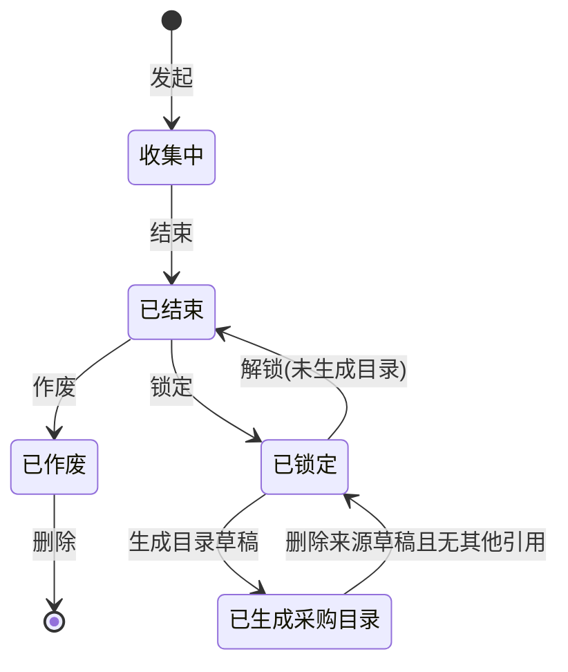
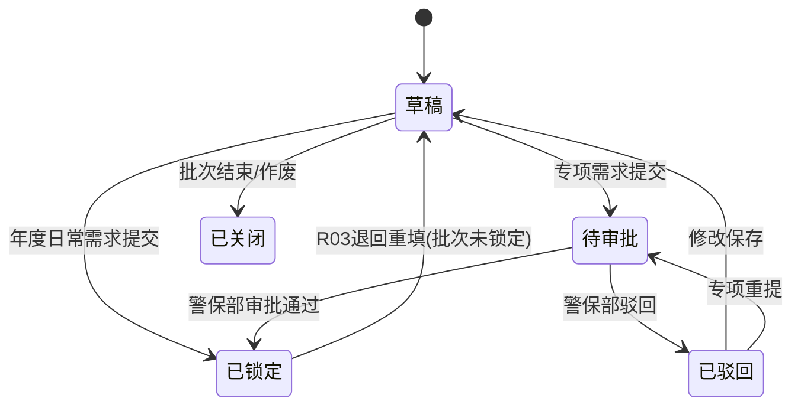
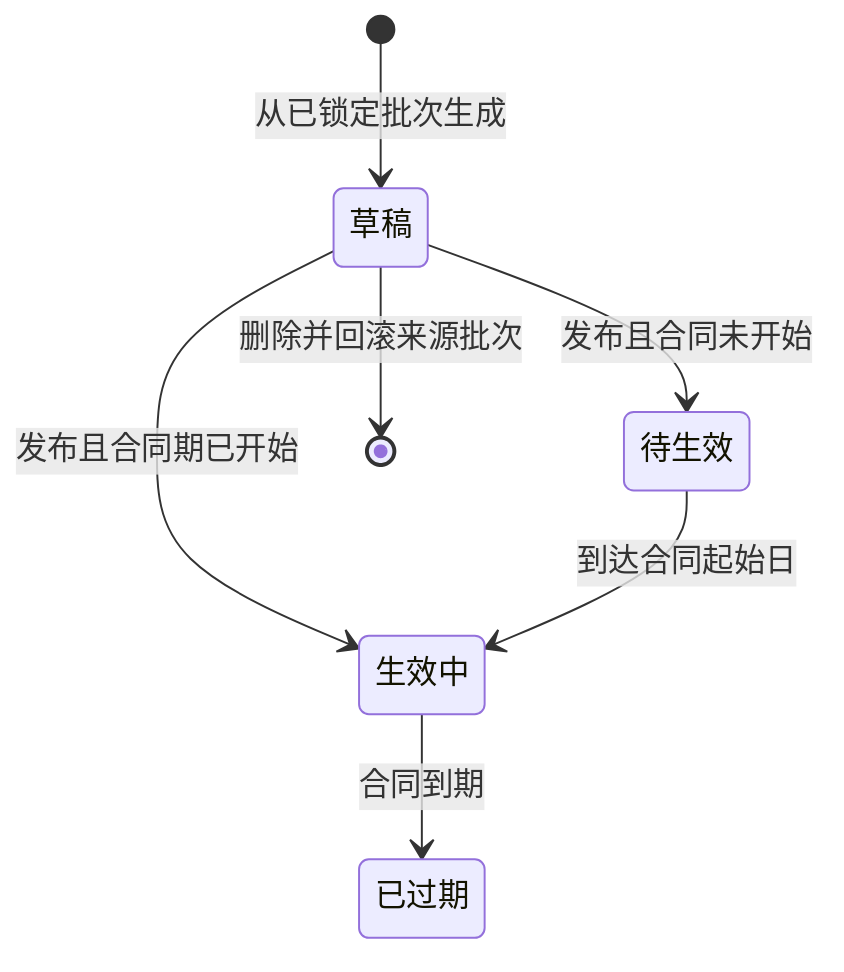
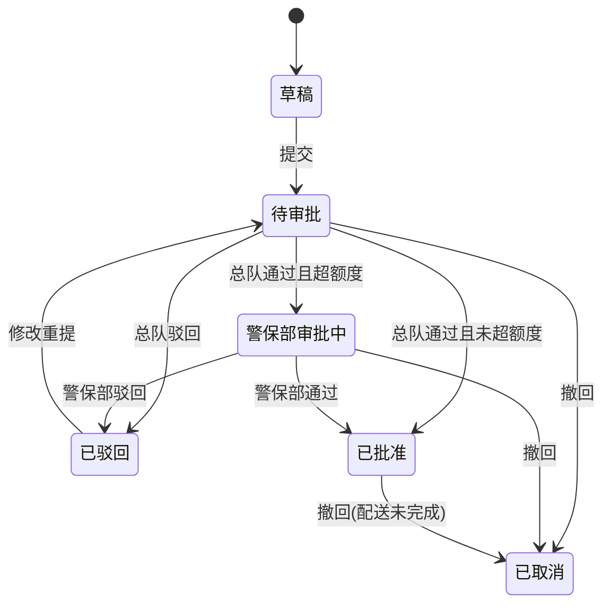
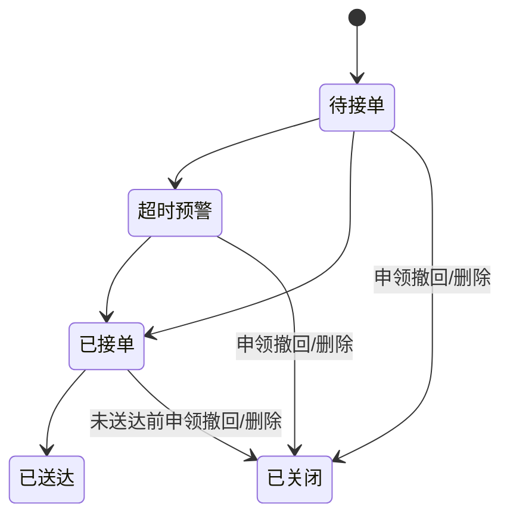

# 办公用品及耗材管理系统产品设计方案

> 更新日期：2026-06-05  

## 一、项目概述

本系统面向警保部、总队、供应商和系统管理员，覆盖办公用品及耗材从需求收集、年度需求填报、采购目录发布、额度生成、线上申领、审批、供应商配送、打印到统计分析的闭环。

当前主链路：

```text
警保部发起需求收集
  -> 总队填报年度日常需求
  -> 可选新增专项需求
  -> 年度日常需求直接锁定 / 专项需求警保部审批锁定
  -> 需求批次结束并锁定
  -> 从已锁定批次生成采购目录草稿
  -> 发布目录并按合同期派生待生效/生效中/已过期
  -> 生成年度单价和额度
  -> 总队线上申领
  -> 总队审批
  -> 超额度时升级警保部审批
  -> 供应商接单与送达
  -> 使用清单、配送单、统计分析和履历留痕
```

## 二、角色与权限

| 角色 | 核心职责 | 数据范围 |
| --- | --- | --- |
| 总队经办民警 | 填报需求、提交申领、查看本人申领和消息 | 本人及本单位业务 |
| 总队领导 | 审批本总队申领，查看本总队额度执行和使用清单 | 本总队 |
| 警保部管理员 | 需求批次、专项审批、目录、额度、超额度审批、全局统计、供应商协同 | 全局 |
| 供应商 | PC/移动端接单、查看配送品目、确认送达、查看消息 | 当前供应商账号 |
| 系统管理员 | 用户组织、字典、规则等基础管理 | 系统管理数据 |

关键权限边界：

1. R03 才能锁定/解锁/作废需求批次、审批专项需求、生成采购目录、审批超额度申领。
2. R02 审批本总队申领；R03 可代查总队审批队列。
3. R04 订单读取层按当前供应商账号过滤，不能只依赖页面 Tab。
4. 已过期供应商或供应商账号在业务读取中视为不可用。

## 三、核心业务对象

| 对象 | 说明 |
| --- | --- |
| 需求收集批次 | 警保部按年度和采购大类发起的收集任务，控制填报、结束、锁定、作废和目录生成 |
| 采购需求单 | 总队填报的年度日常需求或专项需求 |
| 采购需求明细 | 需求单内品目数量、年度单价、预计金额和校验口径 |
| 品目年度单价 | 按品目和年度保留合同期价格历史 |
| 单位年度使用快照 | 近三年消耗分析和年度均值参考的数据源 |
| 采购目录/目录项 | 招标合同结果、协议单价、供应商和可申领品目 |
| 额度记录 | 总队年度申报额度、警保部调整额度、已消耗、在途和入口状态 |
| 申领单/申领明细 | 经办申领业务单和申领时的目录快照 |
| 供应商配送单 | 审批通过后按供应商拆出的接单/送达对象 |
| 状态履历/消息 | 需求、申领、审批、配送过程的留痕和通知 |

关键统计口径：

1. 锁定完成率 = 已锁定目标单位数 / 总目标单位数。
2. 年度最终额度 = 总队申报额度 + 警保部调整额度。
3. 年度最终剩余可用金额 = 年度最终额度 - 已消耗金额 - 在途申领金额。
4. 可分配总额度 = 中标金额 - 总队申报总额。
5. 已分配额 = 警保部调整额度。
6. 批量分配已配置额度 = 当前已分配额 + 本次追加金额。
7. 剩余可分配额 = 可分配总额度 - 已分配额。

## 四、业务模块

### 4.1 采购需求

1. 警保部在 `/demand-plan` 发起年度日常需求收集，为启用总队生成填报工单。
2. 需求收集进度是 R03 的首屏；选中批次后进入当前批次的 `采购需求 / 采购需求汇总`。
3. 年度日常需求不得超过均值总额度，提交后直接 `已锁定`。
4. 同页可新增专项需求，专项额度不得超过年度日常需求额度 × `specialSupportLimitPercent`。
5. 专项需求提交后进入警保部审批；审批通过后锁定，驳回后可重填。
6. R03 可在“需求单已锁定、批次未锁定、未生成目录”时退回为草稿重填。
7. 批次可结束、锁定、解锁、作废、删除；解锁只对未生成目录的已锁定批次开放；删除仅限已作废且未生成目录，或收集中/已结束且无已提交/待审批/已锁定需求数据（服务层自动转作废）。

### 4.2 采购目录

1. 采购目录草稿只从 `已锁定` 且未生成目录的需求批次生成。
2. 目录草稿维护供应商、协议单价、中标金额、合同起止日期。
3. 发布后写入年度单价和额度记录。
4. 目录展示状态由合同日期派生：合同起始日前待生效，合同期内生效中，合同截止后已过期。
5. 删除来源草稿目录时，如果没有其他目录引用该批次，则来源批次回滚为 `已锁定`。

### 4.3 额度与资金

1. 额度管理展示总队申报额度、警保部调整额度、年度最终额度、已消耗、在途、剩余可用。
2. 顶部汇总展示中标金额、总队申报总额、可分配总额度、已分配额、剩余可分配额。
3. 可分配总额度 = 中标金额 - 总队申报总额；剩余可分配额 = 可分配总额度 - 已分配额。
4. 批量分配额度弹窗展示当前已分配额、追加金额、已配置额度，防止追加后超过可分配额度。
5. 支持追加额度和变更履历；申领入口状态由系统在超过年度最终剩余可用金额时自动关闭，不提供人工冻结与授权开放入口。
6. 额度执行看板按角色范围展示年度执行进度和预警状态。
7. `quarterFloatPercent` 动态计算当前季度浮动阈值，默认 10% 只是一种配置。

### 4.4 线上申领与审批

1. 经办从生效目录加入申领车并提交。
2. 提交阶段检查入口状态；入口由系统自动关闭后，该总队禁止提交申领。
3. 申领金额超过年度最终剩余可用金额时，系统关闭该总队入口并阻断提交。
4. 申领金额超过当前季度浮动阈值时，系统标记超额度，但仍允许提交进入总队审批。
5. 总队审批通过且未超额度时直接 `已批准`，并生成供应商配送单。
6. 总队审批通过且超额度时进入 `警保部审批中`，由 R03 审批。
7. 驳回后可在原单修改重提；撤回适用于 `待审批`、`总队审批中`、`警保部审批中`、`已批准`（配送未完成时）；撤回后原单 `已取消`，不回草稿。

### 4.5 供应商协作

1. 申领批准后按供应商拆分配送单。
2. 供应商可在 PC 或移动端查看本供应商订单，接单并填写预计送达。
3. 供应商确认送达后进入 `已送达`。
4. 申领撤回或删除时，未送达配送单进入 `已关闭`，保留关闭原因、关闭时间、总队、申请人和供应商上下文。
5. `已关闭` 是展示态，可由关闭元数据或关联申领单撤回状态派生。

### 4.6 打印与统计

1. 使用清单打印和配送单打印都先打开预览页，再触发浏览器打印。
2. 统计模块包括申领与消耗、额度执行看板、消耗明细、近三年消耗分析、使用清单打印和估值对比。
3. 申领与消耗包含申领台账、统计图表、消耗明细三个页签；申领台账和消耗明细年度筛选默认当前年度。
4. 统计图表按当前年度展示申领订单数、三大类使用数量/采购目录中标数量占比、三大类消耗金额、各总队消耗金额对比。
5. 近三年消耗分析包含资金分析和近三年年度使用；年度使用列表按年度、总队、采购大类顺序展示。
6. R02 默认本总队范围，R03 默认全局范围。

## 五、核心状态机

### 5.1 需求收集批次



| 状态 | 说明 |
| --- | --- |
| 收集中 | 发起即进入该状态，不再依赖批次草稿主流程 |
| 已结束 | 停止继续填报，未提交/草稿/驳回工单关闭 |
| 已锁定 | 可作为采购目录草稿来源 |
| 已生成采购目录 | 已进入目录生成链路，不再可选 |
| 已作废 | 已结束后作废；批次废止后可重新发起同年度同类目收集；无真实数据的收集中/已结束批次也可删除（服务层自动作废） |
| 已归档 | 历史兼容态，现页面不作为主操作入口 |

### 5.2 采购需求单



| 状态 | 说明 |
| --- | --- |
| 草稿 | 可编辑，不纳入汇总 |
| 待审批 | 专项需求等待警保部审批 |
| 已锁定 | 年度日常提交后或专项审批通过后进入，纳入汇总 |
| 已驳回 | 专项需求驳回，可修改重提 |
| 已关闭 | 批次结束/作废关闭未继续流转的工单 |

### 5.3 采购目录



### 5.4 申领单



超额度处理：

| 场景 | 当前处理 |
| --- | --- |
| 入口关闭（系统自动） | 阻断提交 |
| 超过年度最终剩余可用金额 | 阻断提交，并自动关闭入口 |
| 超过当前季度浮动阈值 | 标记超额度，走总队审批后升级警保部审批 |

### 5.5 供应商配送单



## 六、主导航结构

| 分组 | 主要页面 |
| --- | --- |
| 申领与审批 | 采购目录浏览、我的申领车、我的申领单、总队审批队列、超额度审批 |
| 需求与目录 | 采购需求、采购目录管理、用品目录库 |
| 额度与资金 | 额度管理、额度执行看板 |
| 台账与统计 | 申领与消耗、近三年消耗分析、使用清单打印、估值对比分析 |
| 供应商协同 | 供应商订单协作、配送品目清单、供应商管理 |
| 系统配置 | 用户与组织、规则配置、字典管理、消息通知 |


## 七、规则配置

| 配置项 | 当前用途 |
| --- | --- |
| 自然月起算日 | 财政年度、合同年度和周期边界 |
| 季度浮动额度 | 当前季度阈值 = 季度基准比例 + 浮动比例 |
| 专项保障比例 | 专项需求额度 = 年度日常需求额度 × 该比例 |
| 供应商未接单超时 | 生成供应商超时预警 |
| 消息推送对象 | 规则型消息接收角色；为空时不生成该规则消息 |

## 八、设计结论

1. 需求计划、目录、额度、申领、供应商配送必须按状态机闭环理解，不能只看单页面按钮。
2. 当前有效的需求主流程是年度日常需求 + 可选专项需求。
3. 季度浮动阈值不是提交阻断线，而是超额度升级审批的判断来源之一。
4. 申领撤回是关闭原单，不回草稿；`待审批`/`总队审批中`/`警保部审批中`/`已批准`（配送未完成时）均可撤回；未送达配送单同步关闭并留痕，已送达配送单不受影响。
