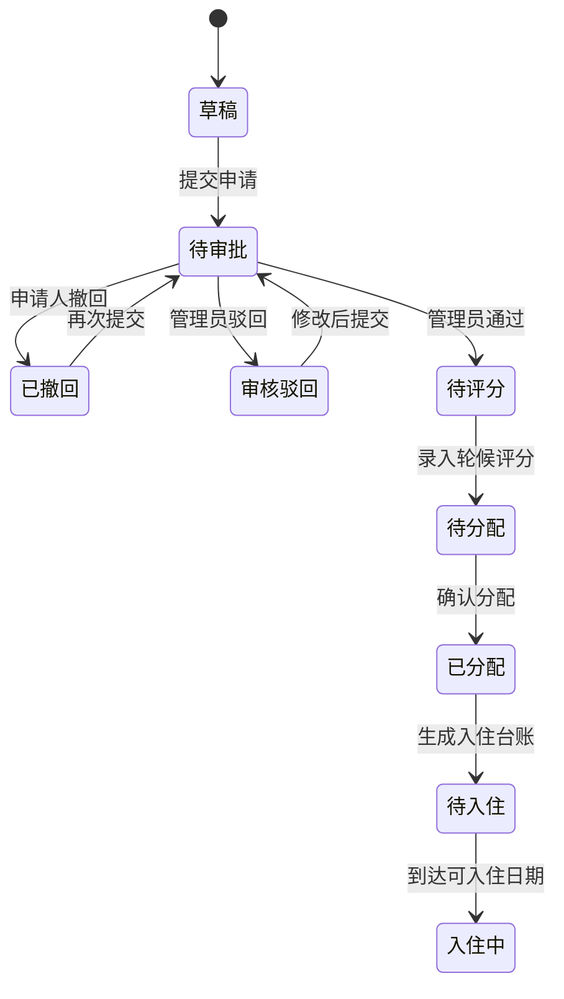
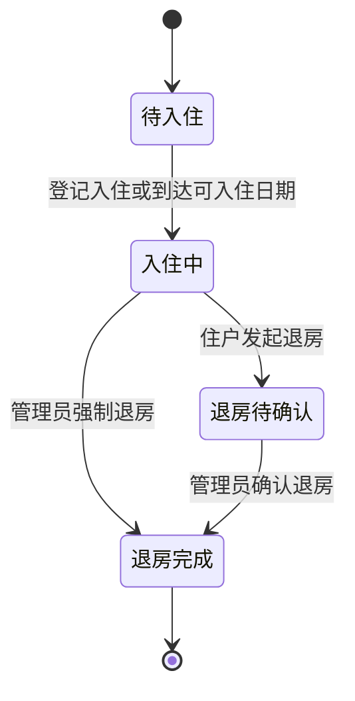
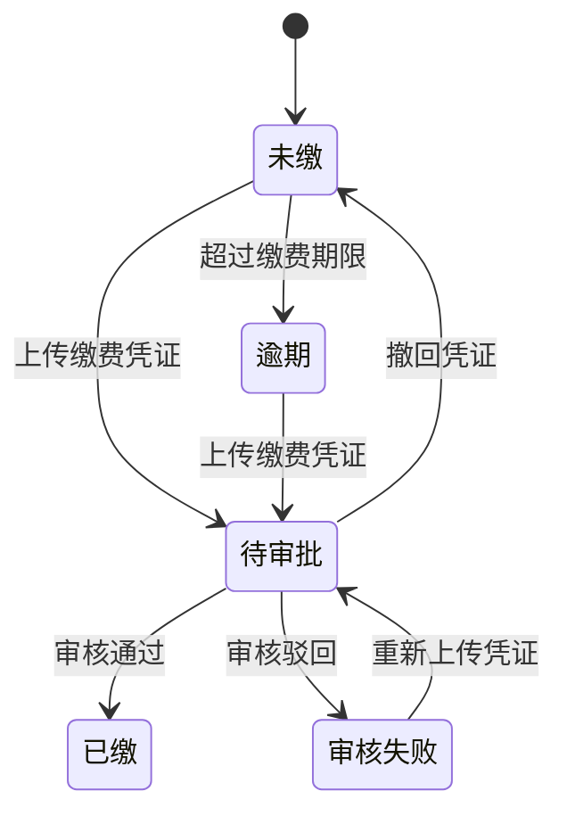
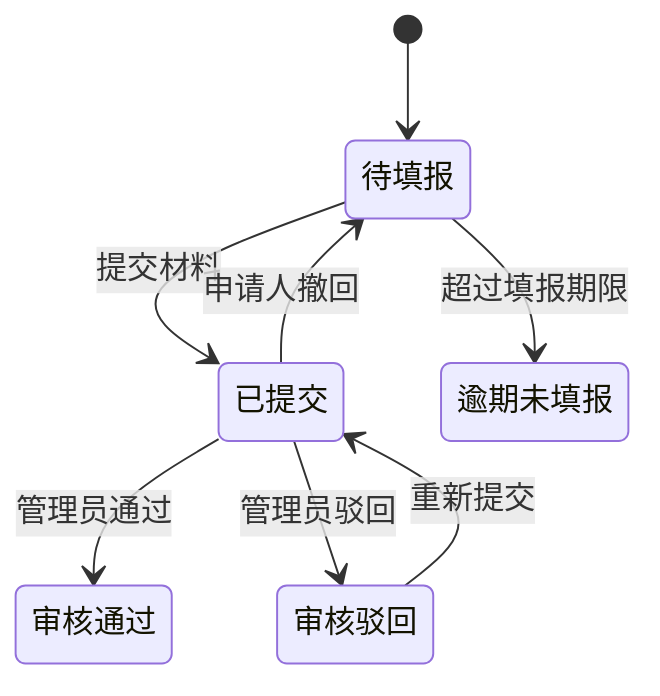
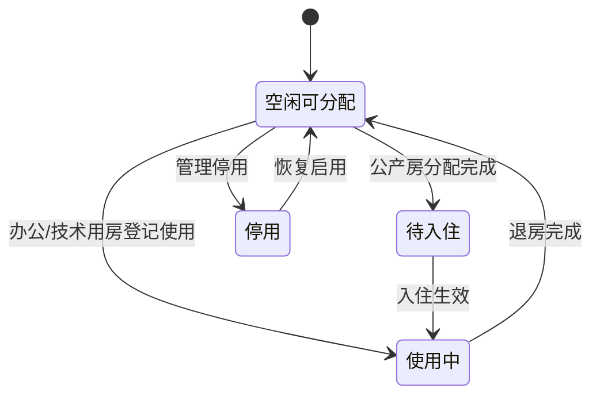
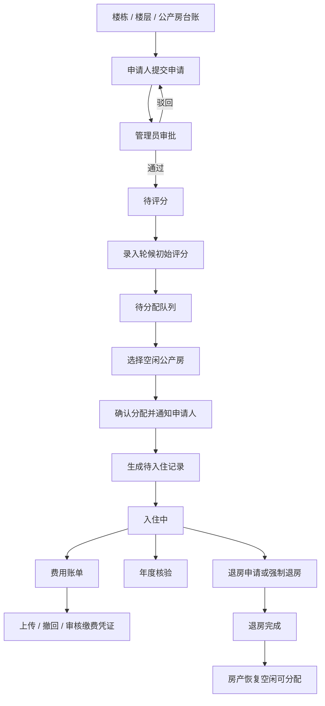

# 办公用房及公产房管理系统产品设计方案

> **项目名称**：办公用房及公产房管理系统
> **文档版本**：V3.0
> **更新日期**：2026-05-07
> **面向对象**：客户管理层、业务负责人、研发团队、相关审核人员

---

## 一、项目概述

本系统面向办公及技术用房、公产房两类房产资源，建立统一的空间台账、业务办理、费用管理、年度核验和消息通知能力。系统以"楼栋、楼层、房产台账"为底座，以"申请、轮候评分、分配、入住、账单、核验、退房"为公产房主流程。

- **办公及技术用房**：侧重基础台账、登记使用和统计看板。
- **公产房**：侧重住户全生命周期闭环管理。

---

## 二、核心角色与权限

### 2.1 角色定义

| 角色 | 职责说明 | 核心入口 |
|---|---|---|
| 申请人/住户 | 发起公产房申请，查看本人申请、入住、账单、核验和消息；上传或撤回待审批缴费凭证，发起退房。 | 我的申请、我的入住、我的帐单、年度核验、移动端工作台 |
| 房产管理员 | 维护楼栋、楼层、房产台账，审核申请，录入轮候评分，执行分配与入住登记，办理退房、费用、凭证、核验和通知。 | 楼栋管理、房产台账、用房看板、公产房管理、费用管理、规则配置 |
| 领导/查询角色 | 查看业务台账、轮候评分、分配、入住、退房、年度核验和看板统计，不进行高权限配置和凭证审核。 | 用房看板、公产房管理、费用账单、消息通知列表 |
| 超级管理员 | 拥有全部业务配置和系统配置权限，维护用户、枚举字典、计价标准和提醒规则。 | 全部业务菜单、用户管理、枚举字典管理 |

### 2.2 权限矩阵

| 功能域 | 申请人 | 领导 | 房产管理员 | 超级管理员 |
|---|---|---|---|---|
| 基础数据与房产台账 | 不可见 | 不可见 | 维护 | 维护 |
| 用房看板 | 不可见 | 查看 | 查看 | 查看 |
| 公产房申请 | 本人提交/查看/撤回/重新提交 | 查看全部 | 审核/查看全部 | 审核/查看全部 |
| 轮候评分 | 查看本人流转结果 | 查看记录和排行 | 录入/查看 | 录入/查看 |
| 分配记录 | 查看本人分配工单 | 查看 | 分配/查看 | 分配/查看 |
| 入住情况 | 查看本人 | 查看全部 | 登记/查看全部 | 登记/查看全部 |
| 退房管理 | 发起本人退房/查看本人退房 | 查看全部 | 确认退房/强制退房 | 确认退房/强制退房 |
| 费用账单 | 查看本人/上传或撤回凭证 | 查看全部 | 查看全部/审核凭证 | 查看全部/审核凭证 |
| 年度核验 | 本人填报/撤回/查看结果 | 查看全部 | 创建任务/审核 | 创建任务/审核 |
| 消息通知 | 查看本人消息 | 查看本人消息 | 查看本人消息 | 查看本人消息 |
| 规则配置 | 不可见 | 不可见 | 维护 | 维护 |
| 系统配置 | 不可见 | 不可见 | 不可见 | 维护 |

---

## 三、业务对象

| 对象编号 | 业务对象 | 说明 | 关键字段 |
|---|---|---|---|
| O01 | 楼栋 | 房产空间一级载体 | 楼栋名称、楼栋地址、楼栋用途、状态 |
| O02 | 楼层 | 楼栋下的空间层级 | 所属楼栋、楼层名称、楼层编号、排序 |
| O03 | 房产/房间 | 可登记、可分配、可入住的具体房源 | 房产名称、房间号、房产类型、所属楼栋、所属楼层、户型、使用面积、当前状态 |
| O04 | 公产房申请 | 申请人发起的住房申请 | 申请人、家庭成员、住房情况、附件、当前状态、审批意见 |
| O05 | 轮候评分 | 审批通过后的评分记录 | 申请单、轮候初始分、轮候起算时间、当前轮候分、评分明细、附件 |
| O06 | 分配记录 | 房源分配结果 | 申请单、申请人、房产、可入住日期、分配状态、备注 |
| O07 | 入住记录 | 实际入住或待入住台账 | 入住人、房产、入住日期、可入住日期、入住状态、租金快照、物业费快照 |
| O08 | 退房记录 | 申请退房或强制退房记录 | 退房工单号、入住记录、房产、退房人、退房原因、退房状态、退房日期 |
| O09 | 费用账单 | 公产房费用记录 | 入住记录、账单编号、账单年月、房租、物业费、应收总额、缴费状态 |
| O10 | 缴费凭证 | 住户上传缴费材料 | 关联账单、凭证图片、审核状态、审核意见、撤回状态 |
| O11 | 年度核验 | 在住人员年度资格核验 | 核验年度、住户、房产、所属楼栋、楼层、附件、填报状态、审核状态 |
| O12 | 消息通知 | 业务节点通知 | 通知对象、标题、内容、类型、是否已读、触发时间 |
| O13 | 操作履历 | 关键业务动作留痕 | 关联对象、事件类型、操作人、事件时间、事件说明 |
| O14 | 计价标准 | 租金和物业费规则 | 租金单价、物业费单价、固定年限、涨价周期、涨幅 |
| O15 | 提醒规则 | 欠费、核验等提醒策略 | 提醒类型、触发天数、通知对象、是否启用 |

---

## 四、核心业务模块

### 模块一：楼栋与房产台账

- 楼栋支持维护"楼栋用途"，分为"办公"和"公产房"。
- 房产台账展示房产名称、所属楼栋、楼层、房间号、户型、使用面积、当前状态等信息。
- 公产房详情展示分配记录、入住状态、入住日期、入住时长、退房日期、费用账单和操作履历；非公产房不展示分配记录页签。

### 模块二：用房看板

- "用房看板"包含办公及技术用房看板、公产房使用看板两个场景。
- 办公及技术用房看板展示数量、面积、类型、状态和楼栋房产利用情况，并去除所属楼栋筛选条件。
- 公产房使用看板的所属楼栋筛选仅展示楼栋用途为"公产房"的楼栋，去掉"入住状态概览"，将"公产房费用预估"和"近 6 个月申请趋势"放在同一行展示。

### 模块三：公产房申请与轮候评分

- 申请人填写自管公有住房申请表，包含个人信息、家庭成员、住房情况、证明材料和承诺信息。
- 管理员审核通过后，申请进入待评分。
- 管理员录入轮候初始分、轮候起算时间、评分明细和附件，形成 `applicationScore` 评分记录。
- 系统在轮候评分记录和排行榜中展示当前轮候分，作为分配候选排序依据。

### 模块四：分配、入住与退房

- 分配记录包含待分配、分配完成和全部页签。
- 分配详情按"基本信息、轮候评分信息、分配结果信息"三层展示，并显示房产名称、所属楼栋、房产地址、房间号、楼层、户型、使用面积、可入住日期和备注。
- 管理员完成分配后，系统生成待入住记录并发送消息通知申请人。
- 超过可入住日期后，申请人在移动端"我的入住"看到的状态应显示为"入住中"。
- 退房完成后，退房工单号统一写入并在"我的申请"单据流转中展示；退房详情显示所属楼栋、房间号、户型、使用面积等信息。

### 模块五：费用账单与缴费凭证

- 费用账单展示房租、物业费、应收总额、账单年月、房间号、缴费方式和缴费状态。
- 费用账单列表去掉查询条件中的"缴费状态"，以全部/未缴/已缴/待审核页签承载状态筛选。
- 所属楼栋筛选通过房产所属楼层反查楼栋，保证只显示楼栋名称。
- 申请人可在 PC 和移动端上传缴费凭证；凭证处于待审批时允许撤回。
- 管理员在"缴费凭证管理"中查看账单详情、凭证详情，审核通过或驳回。

### 模块六：年度核验

- 管理员创建年度核验任务，同年度重复创建会被阻断。
- 申请人提交无房证明等材料；已提交状态可撤回。
- 年度核验详情的申报信息展示所属楼栋、楼层、房产信息、附件和操作履历。

### 模块七：消息通知与履历

- 申请提交、审批结果、评分完成、分配完成、入住登记、账单通知、凭证审核、年度核验、退房确认等节点均写入消息或操作履历。
- 分配完成后，申请人收到分配房产信息、可入住信息和备注说明。
- 头部消息浮窗展示当前用户最近未读消息；消息通知列表展示当前用户全部相关通知。

---

## 五、业务状态机

### 5.1 公产房申请与分配



### 5.2 入住与退房



### 5.3 费用账单与凭证



### 5.4 年度核验



### 5.5 房产状态



---

## 六、公产房全生命周期流程



---

## 七、关键业务流程说明

### 7.1 公产房申请到入住

```text
申请人提交申请
  -> 管理员审核
  -> 审核通过进入待评分
  -> 管理员录入轮候评分
  -> 进入待分配
  -> 管理员分配房源并填写可入住日期和备注
  -> 系统生成待入住记录并通知申请人
  -> 到达可入住日期或完成入住登记后显示入住中
```

### 7.2 费用与凭证

```text
生成费用账单
  -> 申请人查看本人账单
  -> 个人缴费上传凭证
  -> 待审批凭证可撤回
  -> 管理员审核通过后账单已缴
  -> 管理员驳回后账单审核失败，可重新上传
```

### 7.3 年度核验

```text
管理员创建年度核验任务
  -> 系统生成在住人员核验记录并通知
  -> 申请人提交材料
  -> 已提交可撤回
  -> 管理员审核通过或驳回
```

### 7.4 退房释放

```text
申请人发起退房或管理员强制退房
  -> 形成退房工单
  -> 管理员确认退房
  -> 入住记录变为已退房
  -> 房产恢复空闲可分配
```

---

## 八、主导航结构

| 一级菜单 | 二级菜单 | 使用对象 |
|---|---|---|
| 基础数据 | 楼栋管理、房产台账、用房看板 | 房产管理员、超级管理员、领导 |
| 公产房管理 | 我的申请、申请记录、轮候评分记录、分配记录、入住情况、退房情况、年度核验 | 申请人、房产管理员、超级管理员、领导 |
| 入住情况 | 我的入住、我的帐单、年度核验 | 申请人 |
| 费用管理 | 费用账单、缴费凭证管理 | 房产管理员、超级管理员、领导 |
| 消息管理 | 消息通知列表 | 全部登录角色 |
| 规则配置 | 计价标准配置、提醒规则配置 | 房产管理员、超级管理员 |
| 系统配置 | 用户管理、枚举字典管理 | 超级管理员 |

---

## 九、消息通知与操作履历

| 触发节点 | 通知对象 | 履历对象 |
|---|---|---|
| 申请提交 | 房产管理员、超级管理员 | 申请单 |
| 审批通过/驳回 | 申请人 | 申请单 |
| 评分完成 | 管理端相关角色 | 申请单、评分记录 |
| 分配完成 | 申请人 | 分配记录、房产、入住记录 |
| 入住登记 | 申请人、房产管理员 | 入住记录、房产 |
| 账单产生/欠费提醒 | 申请人 | 账单 |
| 凭证上传/撤回/审核 | 申请人、房产管理员 | 账单、凭证 |
| 年度核验创建/撤回/审核 | 申请人、房产管理员 | 年度核验 |
| 退房申请/退房确认/强制退房 | 申请人、房产管理员 | 退房记录、入住记录、房产 |

---