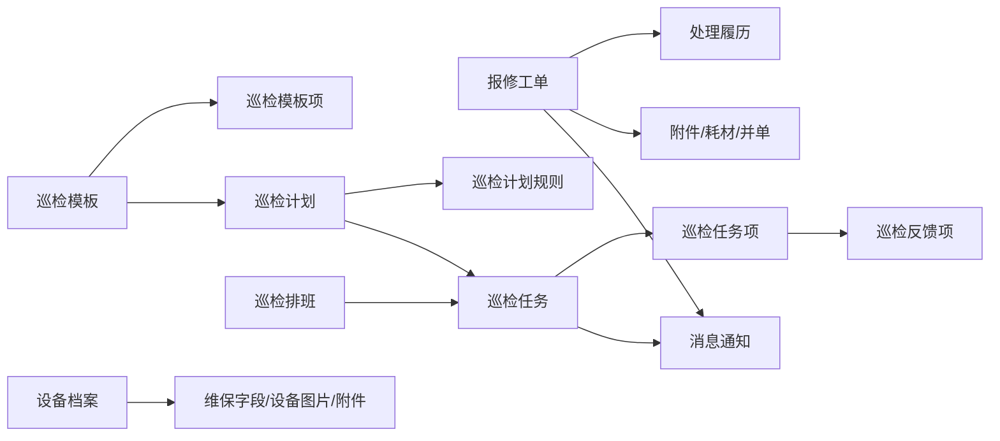
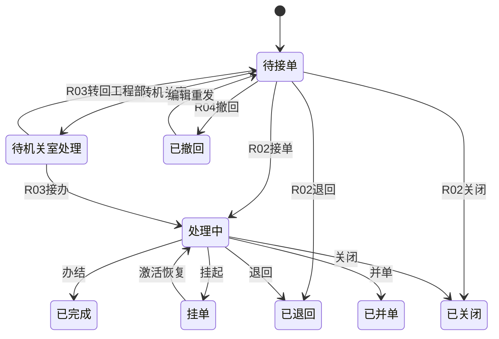
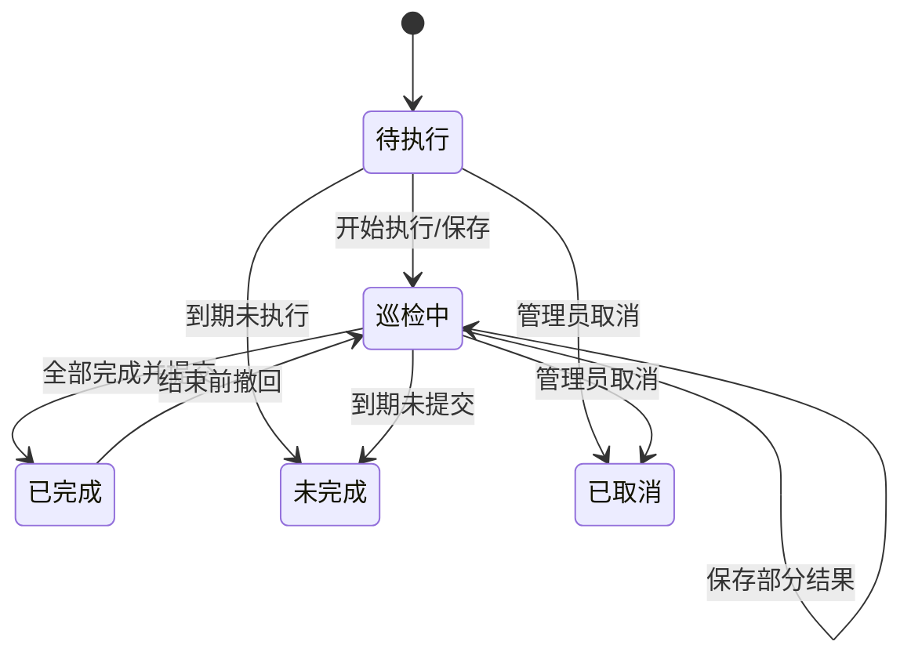

# 物业管理子系统产品设计方案
> 更新日期：2026-06-13（v4.1）  
---

## 一、项目概述

### 1.1 建设目标

本系统面向机关单位物业工程管理、设备运维、现场巡检和后勤保障场景，覆盖报修工单、巡检管理、设备档案、消息通知、统计分析、移动现场作业等核心业务。

系统目标：

1. 建立统一物业工程业务平台，实现报修工单、设备台账、巡检任务和现场执行留痕统一管理。
2. 建立标准化巡检体系，以巡检模板、巡检计划、巡检排班、巡检任务和逐项反馈组成完整闭环。
3. 建立设备档案管理体系，统一维护设备基础信息、维保单位、联系人、维保到期日期、设备图片和附件。
4. 建立移动现场作业能力，覆盖移动报修、移动工单、移动巡检执行、移动设备查看、移动排班查看、移动消息。
5. 建立统一消息通知中心，实现工单提醒、巡检提醒、异常提醒和超时预警协同。
6. 建立统计分析能力，为工程管理提供工单、巡检、耗材等数据支撑。

### 1.2 当前业务链路

```text
报修工单提交
  -> 工程部主管接单
  -> 工程部处理 / 转机关室处理 / 挂单 / 退回 / 关闭 / 并单
  -> 工单办结
  -> 消息通知与统计分析

巡检模板维护
  -> 巡检计划配置
  -> 巡检排班
  -> 自动生成巡检任务
  -> PC端/移动端执行巡检
  -> 保存部分反馈 / 全部完成后提交
  -> 结束前可撤回修改
  -> 逐项反馈、照片、备注留档

设备档案维护
  -> 设备新增/编辑/删除/批量导入
  -> 设备图片、附件、维保到期字段维护
  -> 维保临期/到期提醒
```

---

## 二、核心角色

| 角色 | 编号 | 核心职责 |
|---|---|---|
| 系统管理员 | R01 | 用户、区域、字典、规则和业务基础数据配置 |
| 工程部主管 | R02 | 工单首接与闭环、设备档案维护、巡检模板/计划/排班/任务管理、统计查看 |
| 机关室/警保部人员 | R03 | 机关室待办接办、小额/专项修缮处理、配置和业务查看 |
| 报修民警 | R04 | 提交报修、查看和处理本人工单 |
| 巡检员 | R05 | 执行巡检任务、查看设备档案、查看本人排班、接收消息 |

### 2.1 角色与权限矩阵说明

以下矩阵用于说明当前系统中各角色对主要模块和核心页面的访问关系：

- `可访问` 表示当前路由、菜单或移动端入口允许该角色进入对应模块或页面。
- `仅本人/部分` 表示只能访问本人相关数据，或只能处理限定状态下的本人单据。

| 模块/页面 | R01 | R02 | R03 | R04 | R05 |
|---|---|:---:|:---:|:---:|:---:|
| 工作台 | - | ✅ | ✅ | - | - |
| 报修工单-待处理 | - | ✅ | ✅ | - | - |
| 报修工单-全部/我的 | - | ✅ | ✅ | 仅本人 | 仅本人发起 |
| 耗材使用/耗材统计 |  - | ✅ | ✅ | - | - |
| 设备档案 |  - | ✅ | ✅ | - | ✅ |
| 巡检任务 |  - | ✅ | ✅ | - | ✅ |
| 巡检模板 |  - | ✅ | ✅（查看） | - | - |
| 巡检计划 |  - | ✅ | ✅（查看） | - | - |
| 巡检排班 |  - | ✅ | ✅（查看） | - | ✅（移动端查看） |
| 统计分析 |  - | ✅ | ✅ | - | - |
| 消息通知 | ✅ | ✅ | ✅ | ✅ | ✅ |
| 个人中心 | ✅ | ✅ | ✅ | ✅ | ✅ |
| 系统配置 | ✅ | - | ✅ | - | - |
| 业务数据配置 | ✅ | ✅ | ✅ | - | - |

### 2.2 角色权限补充说明

1. R02 是报修工单和巡检管理的主业务角色，拥有工单接单、转交、挂单、办结，以及巡检模板、计划、排班、任务管理权限。
2. R03 重点负责机关室接办的小额修缮和专项修缮，同时具备部分配置页和统计页查看权限，但不是巡检配置主维护角色。
3. R04 主要访问本人报修相关页面，核心能力是发起报修、查看进度、撤回、重发、关闭或删除部分本人终态工单。
4. R05 主要访问移动端工作台、工单、巡检任务、排班和设备档案；在巡检任务中拥有执行、保存、提交和撤回修改权限。
5. 移动端首页与工作台按角色分流，R04/R05 默认进入移动工作台，R02/R03 默认进入移动首页。

---

## 三、核心业务对象

| 业务对象 | 业务说明 | 核心关系 |
|---|---|---|
| 报修工单 | 日常维修业务主体 | 关联区域、附件、耗材、履历、并单、消息 |
| 工单附件 | 报修照片、完工照片 | 关联报修工单 |
| 工单耗材 | 工单处理过程中的耗材明细 | 关联报修工单和耗材主数据 |
| 设备档案 | 设备基础台账 | 记录区域、状态、维保字段、设备图片、附件 |
| 巡检模板 | 巡检检查项配置主体 | 包含分组检查项 |
| 巡检模板项 | 检查项明细 | 作为计划选择和任务项快照来源 |
| 巡检计划 | 周期和范围配置 | 绑定巡检模板和计划规则 |
| 巡检计划规则 | 周期、区域、提醒、包含项配置 | 关联巡检计划和模板 |
| 巡检排班 | 巡检人员、班次、日期、区域 | 用于任务生成时匹配巡检员 |
| 巡检任务 | 巡检执行主体 | 关联任务项、任务元数据和逐项反馈 |
| 巡检任务项 | 任务生成时的检查项快照 | 来源于模板项 |
| 巡检反馈项 | 逐项反馈结果 | 保存正常/异常、备注、照片、记录人 |
| 消息通知 | 系统业务提醒 | 来源于工单、巡检、超时等事件 |



---

## 四、核心模块

### 4.1 工作台

1. 展示工单 KPI、超时预警、逾期巡检、维保临期提醒。
2. 支持进入待处理工单、巡检任务、设备档案和消息中心。

### 4.2 报事报修管理

1. 支持报修申请人提交工单、选择区域、填写故障描述、上传照片。
2. 支持紧急标记、高空作业、故障分类、修缮分类和修缮子类。
3. 工程部主管可接单、转机关室、挂单、激活、办结、退回、关闭、并单。
4. 机关室可接办小额/专项修缮，支持转回工程部。
5. 工单办结必须填写实际维修人员、完工说明并上传完工照片。
6. Web 端支持处理中直接追加耗材；移动端办结页支持下拉选择既有耗材或直接输入新增耗材，新增项在确认办结时统一写入耗材主数据和工单耗材明细。
7. 支持耗材记录、处理履历、关联工单、消息通知和 Excel 导出。

### 4.3 设备档案管理

1. 管理设备名称、编号、品牌型号、类型、区域、安装日期、状态、维保单位、联系人、电话、维保到期日期、图片、附件和备注。
2. 支持设备新增、编辑、删除、详情查看、批量导入和模板下载。
3. 支持按关键词、区域、状态等查询。
4. 支持维保临期/到期提醒展示。
5. 当前不提供独立维保记录列表和维保记录录入流程。

### 4.4 巡检管理

1. 巡检模板维护检查项分组、检查内容、检查标准/参考、是否拍照、周期建议和备注。
2. 巡检计划绑定模板，配置巡检类型、周期规则、巡检区域、提醒和包含项。
3. 巡检排班按日期、班次、巡检员和区域维护；移动端支持我的排班/全部排班。
4. 系统按启用计划生成任务，优先按排班匹配巡检员，无匹配则生成共享任务。
5. 巡检员可在 PC 或移动端执行巡检。
6. PC 执行支持分组表格、全屏、分页滚动、全选 and 批量置正常。
7. 移动端执行不提供批量操作，逐项录入。
8. 移动端巡检任务详情与计划详情支持分组折叠；巡检卡片支持“是否拍照”和模板“备注”字段展示。
9. 执行结果支持先保存部分，全部完成后提交。
10. 任务结束时间前允许撤回并修改结果，结束后不可修改。

### 4.5 消息通知中心

1. 工单创建、接办、退回、转派、办结、关闭、超时等发送消息。
2. 巡检任务生成、巡检异常等发送消息。
3. 支持 PC 和移动端查看，支持已读/未读管理和关联单据跳转。

### 4.6 统计分析

1. 报修工单分析：完成数、超时数、平均工作量、平均完成耗时、修缮类型、故障类型、耗材消耗、维修人员工作量、完成趋势。
2. 日常巡检分析：巡检任务总数、已完成巡检任务、巡检计划总数、任务状态、周期分布、巡检员任务量、计划周期、完成趋势。


### 4.7 移动端功能

1. 移动端拥有独立登录页、移动布局和底部 Tab。
2. 支持移动报修、移动工单列表、工单详情、新建报修。
3. 支持移动巡检任务、巡检详情、执行巡检、巡检计划查看、巡检排班查看。
4. 支持移动设备列表和设备详情。
5. 支持移动消息、个人中心、个人信息编辑和密码修改。

---

## 五、业务状态机

### 5.1 工单状态机



### 5.2 巡检任务状态机



---

## 六、规则校验与业务防护

1. 工单办结必须填写实际维修人员、完工说明和完工照片。
2. 移动端办结页耗材先保存为页面草稿，确认办结时统一创建新增耗材主数据并写入工单耗材明细。
3. 工单办结提交流程按“耗材/完工照片/主单状态”顺序落库，避免主单先办结造成子记录缺失。
4. 巡检最终提交必须全部检查项完成。
5. 巡检异常必须填写备注。
6. 模板要求照片的检查项必须上传照片。
7. 巡检任务到达结束时间后不可修改结果。
8. 巡检任务未到结束时间前可撤回并修改。
9. 工单挂单期间不计入超时。
10. 设备编号编辑时不可修改。
11. 设备批量导入校验编号唯一性和区域匹配。
12. 系统无数据占位统一使用英文短横 `-`。

---

## 七、主导航结构

| 分组 | 页面 |
|---|---|
| 工作台 | 工作看板 |
| 报修工单 | 待处理工单、所有工单、耗材使用、报修工单分析 |
| 巡检/维保管理 | 巡检任务、巡检模板、巡检计划、巡检排班、日常巡检分析 |
| 设备档案 | 设备列表、设备详情 |
| 消息通知 | 消息列表、消息详情 |
| 系统配置 | 用户管理、区域管理、字典管理、规则配置 |
| 业务数据配置 | 维修人员、巡检人员、修缮子类、维修耗材 |
| 移动端 | 移动首页、工作台、移动工单、移动巡检、移动设备、移动消息、移动统计、我的 |

---
